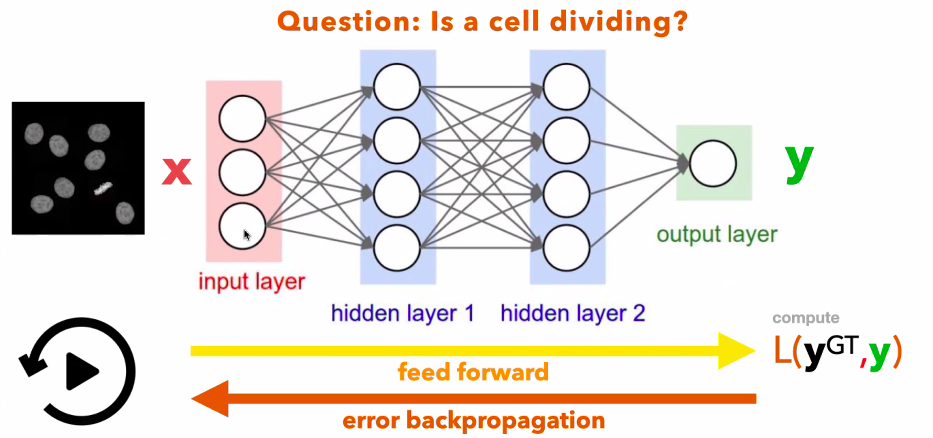
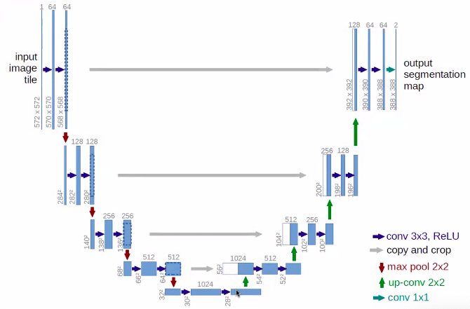
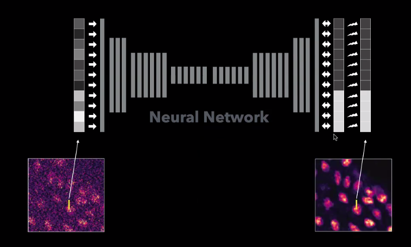
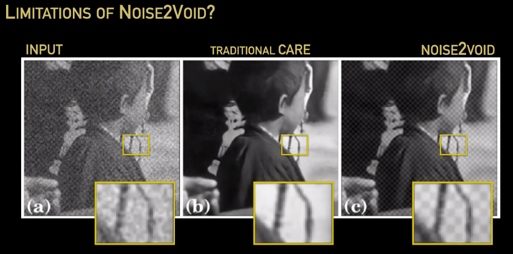
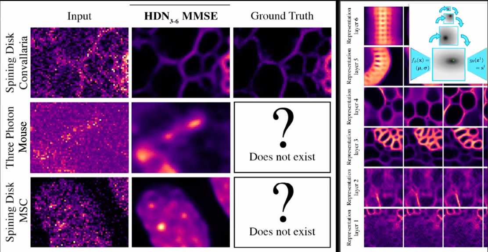
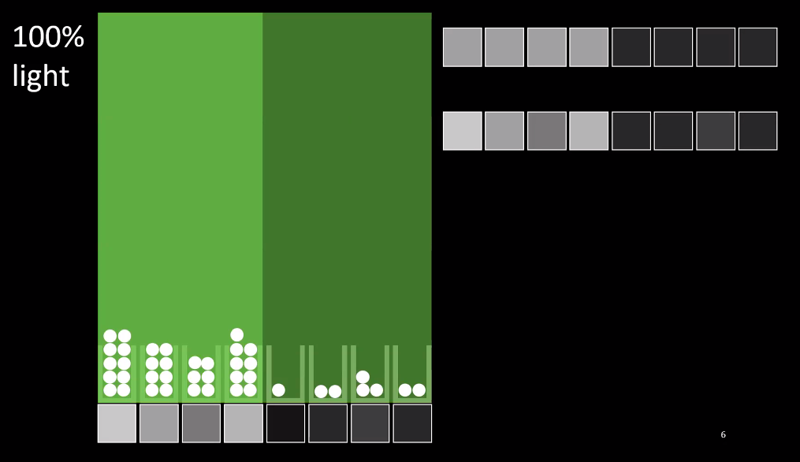
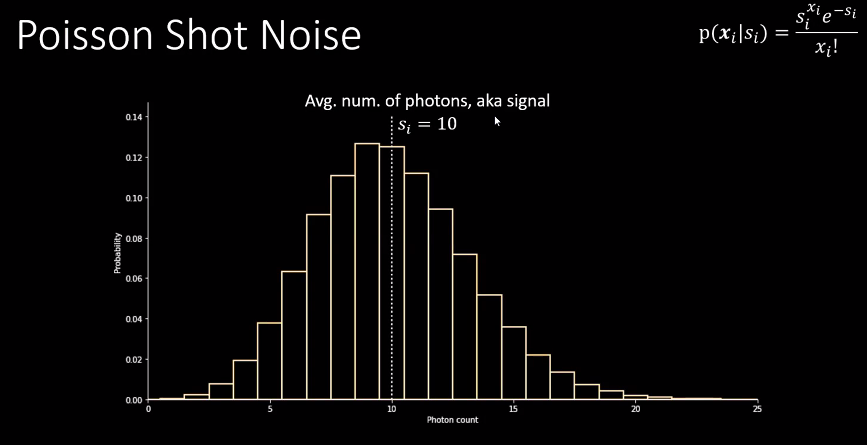
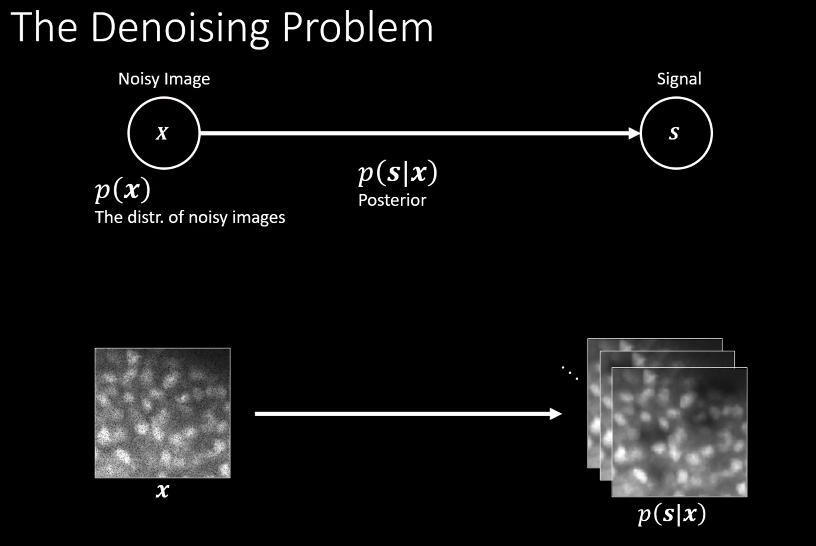
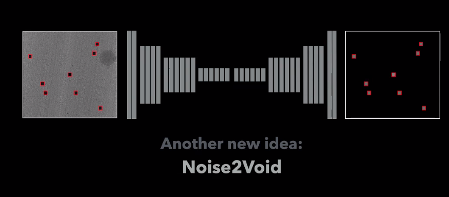

# Notes from the Deep Learning for Microscopy Image Analysis Course
## Day 1
### Virginie Uhlmann (EMBL-EBI) - Deep Learning for bioimage analysis
From 2015 onwards, the number of papers with "Deep learning" in their title has spiked dramatically. One of the most used models for image analysis is U-Net, a convolutional network for biomedical image segmentation, solving this problem with a specific architecture. 
Attempts at classifying images can be split into different tasks such as restoration, partitioning (moving from images to objects within them) and object-based quantification. 
Three main image restoration approaches involve _Deblurring_, so inverting the convolution effects resulting from image acquisition, _Denoising_ and _Image Formation_.
For deblurring, before deep learning there were lots of image theory-based tools manipulating PSFs. On the other hand, restoration using deep learning starts from the data itself. For denoising (additive) there are many algorithms (Noise2Something categories). Another tool specialized for single-molecule localization is DECODE (relying on the U-Net architecture again).
In the context of Image partitioning we can have object recognition, semantic segmentation (boundaries) and instance segmentation (separate categories). Object detection (Waithe _et al._, 2020) works very well also for microscopy images as well as it does for natural objects. Adaptations to bounding-boxes are for example StarDist, where we try to adapt the box into a convex polygon able to capture an object's rough shape (a similar approach is taken by SplineDist). 
Some benchmarking datasets: Caicedo _et al._ 2019 (kaggle data science bowl) and LIVECell. More _generalist_ methods include NucleAIzer and CellPose (where nuclei are predicted on new images from diverse datasets in training).
One other very interesting characteristic about DL is the learning of low-dimensional representations of the data, which may or may not entail biological differences unknown to the model, underscoring the generalization capability.
Another quirky aspect is related to style-transfers, for instance training a network to generate synthetic data from one modality to another, for example going from a binary mask to a "constructed" fluorescent image or a completely synthetic H&E staining (Gatys _et al._, 2016).
Another application is related to the ability of DL to integrate image data and omics (Zinchenko _et al._, 2022 BiorXiv).

### Florian Jug (HT) - The Neural Networks Boot Camp
ML is thought of being a subset of AI which entails the performing of specific tasks by learning trends in the data, and DL is a subset of ML using neural networks. Contrasting programming wih machine learning makes us appreciate how ML is based on data and correct answers to extract rules happening in the system and use these rules to predict outcomes.
The basic unit of a neural network (a "neuron") is called a _perceptron_. Inputs with associated weigths are passed to one non-linear activation function (sigmoid, tanh or ReLU - usually a network has a single activation function). The biggest question while building a neuron and a network is the attribution of input-specific weights. Once a prediction is made, we can compare that with ground truth and _backpropagate_ errors through a _loss function_ (more in detail later) to re-enforce specific edges to match ground truth better. The derivative of the loss function trhough back propagation commands how much change is needed to weights.
What a neural network is essentially learning is a decision boundary which can be multi-dimensional based on the complexity of the network and the activation function (visualize it [here](https://playground.tensorflow.org)).

So, neural networks can get extraordinarily complicated and heavy, so a solution can be _convolution_ which allows us to get weigthed sums for each input using a convolutional filter (kernel).Another strategy for convoution is _max pooling_ where you take the maximum of a set of imputs and shrink them to that specific value. So in order to make a model happen we can use a mix of down-sampling and convolution to achieve this goal.
So with this in mind we can re-visit the U-Net architecture which additionally adds "skip connections" which while you scale the image up from the convoluted layers add information from convoluted layers to the devoncolved ones (grey arrows). Skip connections are there because while scaling up you are forcing very sharp gradients, so to recover information useful for reconstruction we apply information coming from the initially convolved layers. The reasons for its success then are the crazy amount of convolution, the lack of complete connections and the addition of ski connections.

When running the network, not a single input is passed, but inputs are passed in batches of size _k_ while backpropagation takes place at once after all of _k_ has been passed. The first layer of the network instead takes the name of _patch size_. A perk of fully convolutional networks is tha they scale very easily with different patch sizes, where we do not need the same patch size between training and prediction, and this does not apply to fully connected layers, where training and test have to have the same exact size.
So one feed-forwarding of inputs and ground truths for each batch (and its backprop) consist of a single step (or one **epoch**), each epoch happens when a model has seen the whole of the training data. After each epoch we can then ask how good did the model work based on the loss (accuracy).

## Day 2
### Alexander Krull (Birmingham Uni) and Florian Jug - Image Restoration
Content aware image restoration (CARE) (Nat. Methods, 2018) is based on the idea of using high-quality images taken at high photon usage to computationally infer the patterns of lower quality images.

The main advantage of networks trained is the fact that they are aware of the underlying image structure, including shape detection and also magnification since this is a thing we need to train each time features in the image change and/or scales are modified. 
Some drawbacks of CARE are the fact that it is a supervised technique, so we need training data, and training data must be drawn from the same distribution of the actual data with the same features of interest. The output of this image restoration process like CARE is intended to be helpful with downstream analysis like image segmentation and are not meant to be analyzed quantitatively (for which you need raw data).

**BUT** what if sufficient quality training data cannot be imaged? This is the idea behind _Noise2Void_, where a noisy image is taken apart pixel-by-pixel and the vicinity of each one is used to understand the intensity of the taken out pixel. But predicting noisy pixels from noisy neighbors can be hard unless we assume (key assumption) that the noise (Poisson noise) in independent per-pixel, so each time we predict, the prediction is totally independent. This is also the basic concept behind [Noise2Noise](https://arxiv.org/abs/1803.04189) (Lehtinen _et al._, 2018) where noisy images are given as input and output to a network which is actually learning the stochasticity of the noise in the image. Of course, while nice, Noise2Void has some limitations, since we can have pixel-wise noise but also spatial noise (unwanted patterns) the network is going to learn tha as well. Essentially **Noise2Void removes pixel noise only**, it does not care about what our interest is in the image.

Noise2Void is not capable of removing "milky" stuff or blurs, deconvolve while it is very good at removing per-pixel noise, so for low-light conditions for example.

_Diverisity denoising_ (DivNoising), which is the latest iteration of going from a noisy image to results, this specifically entails training from noisy image to complete noisy image and a network is built from a variational autoencoder (VAE) which encodes into a latent space a distribution of possible latent space variables from which we can sample many different x points which allow the operator to look at a series of _denoised interpretations_ which are not very good. So by stacking a number of latent spaces on top of each other (hierarchical VAE) we can go from having a good local representation to a more global one on the full image.

DivNoising is able to remove structural noise if the spatial resolution of our image is untangled from the pixel resolution, or in better words, the readout artefacts are very close to the pixel resolution and so we can take those out and maintain the spatial features of interest. So PFS (optical resolution) should cover more than one pixel.

(Alex Krull) 
Noise and Denoising: Supervised and Self-Supervised
Noise arises from the necessity of having low exposure images with gentle approaches vs high energy but damaging exposure. Noise is created stochastically in images through how light is detectedand how many photons (so discrete quantities) are collected in different collectors on a camera chip.

If we reduce the amount of light we are increasing the amount of noise and darkening the image. Noise is therefore an intrinsic quality of the discrete nature of light.
When looking at this phenomenon from a mathematical perspective, we can model noise with a Poisson distribution capturing the probability of photon counts given a specific signal (s).

Increasing signal intensity widens the distribution and creates more uncertainty, which produces a pradoxical situation in which low signal produces low variation. Nevertheless, if we look at the noise to signal ratio, the noise becomes negligible as the signal becomes more important.
Poisson noise is indeed a very important component of noise in imaging, but there are also other kinds of noise on top of this. 
In order to capture noise, instead of completely model it, we can use a static object under the microscope and compensate for the noise we see while imaging this static object, this process is known as the recording of a noise model, and is a function of the apparatus used for the imaging. In a context of _traditional supervised training_ we can have a distribution of clean images, which can vary based on ROI choice but still be quite similar. Then we can have noisy images by sampling clean images and adding noise on top. Then probability allows us to turn this concept around, we are trying to get to the signal starting from the noise, generating a distribution of probable clean solutions which led to the noise.

But in CARE we do not have any distribution, you provide one image and get one out, so he way it works is based on minimising the _squared error_ between guesses. (this is like predicting 3.5 as the result of a roll of a dice)
In the case of _Noise2Noise_, we assume that the noisy image is the sum of the actual signal and the noise of the image at the pixel level. The assumption here is that noise will be zero-centered. Whereas in CARE we are getting to the clean image through the noisy image, in N2N we are keeping signal the same and changing noise between images and what we are learning is actually the difference in noise.
So both CARE and N2N need image pairs since they are both supervised, even if the second only needs noisy images.

**Self-supervised** denoising instead employs a trick for training where we think that the noise does not have any kind of structure whereas the signal does. Because of the structure of the network, the pixel-specific output is determined by the pixels around the output one (so the receptive field of the network). If the pixel to be predicted gets removed (modified receptive field) then we are able to predict signal, since signal is structured in our assumptions. This "pixel masking" which modifies the receptive field is applied during training and is not part of the actual network structure. 
The advanced extension of N2V is called _probabilistic N2V_ where we try to extend for the missing pixel in the input with prediciting a probability distribution for each missing pixel thanks to a probabilistic noise model.

_Advice on training data_: if training data is very scarce, one trick to many-fold increase the data quantity is to take patches and rotate and/or mirror them.

How to interpret loss curves: the best model possible is the one where the iteration loss is minimum, otherwise the network is fitting data to just the training data (overfitting) and the generalization is decaying. For instance, for supervised pedictions, we need loss curves and these remain interpretable in that way. In the case of Noise2Noise instead, since we are learning noise from noise, the loss will always be greater than 0.

## Day - 3
### Anna Kreshuk (EMBL) - Deep Learning for Image Segmentation
Semantic segmentation, which is something very easily done by humans but something very hard to program. Semantic segmentations set the goal of separating different classes. Before DL, feature-based learning (pixel intensity, and structures) like what happens in _Ilastik_ still works, but in DL you are free from finding this key features in the data. The U-Net, the baseline network for image segmentation is still used also in image segmentation tasks. One of the metrics used for segmentation is _pixel accuracy_, and this is very intersting because the metrics use and the loss compared **depend on the task**.
Losses compare two segmentations (current seg vs. GT) during backpropagation, and one of the most used ones in called the Dice loss and the other one is known as _binary cross entropy_, which can also be weighted.
Things to consider when building a model include the batch size (total number of pixels per training round) and learning rate (how fast do you try to reach the local minima).
Whatever is the training and the task for it, it is important to remain in the same task while predicting. So practically if we train a model to find edges, then it is important to apply it to search for edges. 
Trained models for image segmentation (which can be used programmatically) are present in the model zoo (BioImage.io).

(Florian Jug)
If you can denoise well you are almost also a good segmenter, so this is the idea behind _DenoiSeg_, where while denoising you also provide training images with annotated instances, in this case it was seen that starting from noisier images actually gave better results. Another method is called _EmbedSeg_ (Base on an approach by Neven _et al._). The important thing while choosing which strategy to use for segmentation is to consider how the features that we are trying to capture fit into the receptive field of a network, if this is not the case then one might switch to other methods.

(Manan Lalit) _Notes on Instance segmentation_
Instance segmentation, as opposed to semantic segmentation, is the process of assigning a unique ID to each feature in the image. While using Unets for instance segmentation could work, it tends to merge objects together, so we move to actual instance segmentation, and here is where algorithms like Stardist and EmbedSeg are located, they start from GT objects (training masks) to inderstand the distance between pixels within masked regions and the boundary of the image. So each pixel knows roughly where the center of its obecjt is located. This is still an approach based on U-Nets, although the stardist approach is limited to star-convex polygons. Cellpose on the other hand is limited to 2D objects. So, EmbedSeg was born as a way to avoid this constraints. In EmbedSeg, each pixel is mapped to the center of the object during training, and then during the application we essentially start building instances by asking where does each pixel think the center of its object is.
   
